<div align="center">

# 轻语云配 (SonicVale) - AI 多角色多情绪配音平台

</div>

<p align="center">

<a href="https://sw4s2hg7k5y.feishu.cn/wiki/WjbUw1t7JiWIa7k2pFXcxqSbnde?from=from_copylink">
  
</a>


</p>

> 一个开源的多角色、多情绪 AI 配音生成平台，支持小说、剧本、视频等内容的自动配音与导出。

> 本软件基于开源项目 [《音谷》(SonicVale)](https://github.com/xcLee001/SonicVale) 二次开发。

---

## 功能特性

- **文本导入**：支持小说/剧本文本导入，自动拆分台词
- **多角色管理**：角色库管理，多章节共享角色音色
- **多情绪配音**：支持 10 种情绪类型（高兴、生气、伤心、害怕、厌恶、低落、惊喜、平静、嘲讽、悲愤）与 5 级情绪强度
- **多 TTS 引擎**：支持 IndexTTS-2.0（本地）、火山引擎、阿里云等多种 TTS 服务
- **语音克隆**：支持火山引擎和阿里云的语音克隆功能
- **LLM 台词拆分**：支持兼容 OpenAI API 协议的大模型进行智能台词拆分
- **自定义提示词**：适配个性化拆分需求
- **音频编辑**：精准的音频编辑功能，支持删除音频片段和添加静音片段
- **批量任务管理**：批量配音生成与导出
- **字幕生成**：支持多种 ASR 引擎的字幕生成

## 技术栈

| 层级 | 技术 |
|------|------|
| 前端框架 | Vue 3 + Element Plus |
| 桌面应用 | Tauri (Rust) |
| 构建工具 | Vite |
| 音频可视化 | wavesurfer.js |
| 后端框架 | FastAPI (Python) |
| 数据库 | SQLite (SQLAlchemy) |
| TTS 服务 | IndexTTS-2.0 / 火山引擎 / 阿里云 |
| LLM 接口 | 兼容 OpenAI API 协议的大模型 |

## 项目结构

```
SonicVale/
├── SonicVale/                        # 后端 (Python FastAPI)
│   ├── app/
│   │   ├── core/                     # 核心引擎
│   │   │   ├── tts_engine.py         # TTS 引擎协调器
│   │   │   ├── aliyun_tts_client.py  # 阿里云 TTS 客户端
│   │   │   ├── volcano_tts_client.py # 火山引擎 TTS 客户端
│   │   │   ├── aliyun_voice_clone_client.py   # 阿里云语音克隆
│   │   │   ├── volcano_voice_clone_client.py  # 火山引擎语音克隆
│   │   │   ├── volcano_voice_manager_client.py # 火山引擎音色管理
│   │   │   ├── llm_engine.py         # LLM 对话引擎
│   │   │   ├── audio_engin.py        # 音频处理 (ffmpeg)
│   │   │   ├── subtitle/             # 字幕/ASR 生成模块
│   │   │   ├── ws_manager.py         # WebSocket 连接管理
│   │   │   ├── tts_runtime.py        # TTS 运行时任务队列
│   │   │   ├── config.py             # 应用配置
│   │   │   └── prompts.py            # 默认提示词
│   │   ├── db/                       # 数据库连接
│   │   ├── models/                   # ORM 模型
│   │   ├── dto/                      # 数据传输对象
│   │   ├── entity/                   # 实体类
│   │   ├── repositories/             # 数据库封装
│   │   ├── services/                 # 核心业务逻辑
│   │   ├── routers/                  # FastAPI 路由接口
│   │   └── main.py                   # 后端启动入口
│   ├── tests/                        # 测试
│   └── requirements.txt              # Python 依赖
├── sonicvale-front/                  # 前端 (Vue 3 + Element Plus + Tauri)
│   ├── src/
│   │   ├── api/                      # API 请求模块
│   │   ├── pages/                    # 页面组件
│   │   │   ├── ProjectList.vue       # 项目列表
│   │   │   ├── ProjectDubbingDetail.vue # 配音详情
│   │   │   ├── ConfigCenter.vue      # 配置中心
│   │   │   ├── VoiceManager.vue      # 音色管理
│   │   │   ├── VoiceCloneManager.vue # 语音克隆管理
│   │   │   └── PromptManager.vue     # 提示词管理
│   │   ├── components/               # 可复用组件
│   │   ├── router/                   # 路由配置
│   │   └── utils/                    # 工具函数
│   ├── src-tauri/                    # Tauri 主进程 (Rust)
│   └── package.json
├── image/                            # 截图资源
└── LICENSE                           # AGPL-3.0 许可证
```

## 快速开始

### 1. 克隆项目

```bash
git clone https://github.com/avy1357/sonicvale-aliyun.git
cd SonicVale
```

### 2. 启动后端

首先下载 [ffmpeg](https://www.gyan.dev/ffmpeg/builds/packages/ffmpeg-8.0-full_build.7z)（也可使用[此镜像](https://www.alipan.com/s/ey5QRqW3Jji)），复制到 `SonicVale/app/core/ffmpeg/` 目录下。

```bash
cd SonicVale
pip install -r requirements.txt
uvicorn app.main:app --reload --port 8200
```

### 3. 启动前端

前端基于 Tauri，需要先安装 [Rust 工具链](https://rustup.rs)（Windows 用户另需 [WebView2 Runtime](https://developer.microsoft.com/microsoft-edge/webview2/)，Win11 自带）。

```bash
cd sonicvale-front
npm install
npm run start       # 开发模式（tauri dev）
```

打包构建：

```bash
npm run electron-build   # 输出 NSIS 安装包（tauri build）
```

## 后端 API

后端启动后访问 `http://127.0.0.1:8200/docs` 可查看完整的 API 文档（Swagger UI）。

主要接口模块：

| 模块 | 路径前缀 | 说明 |
|------|----------|------|
| 项目管理 | `/projects` | 项目 CRUD |
| 章节管理 | `/chapters` | 章节 CRUD 与文本导入 |
| 角色管理 | `/roles` | 角色 CRUD 与音色绑定 |
| 台词管理 | `/lines` | 台词 CRUD 与配音生成 |
| 音色管理 | `/voices` | 音色 CRUD |
| 情绪管理 | `/emotions` | 情绪类型管理 |
| 强度管理 | `/strengths` | 情绪强度管理 |
| 多情绪音色 | `/multi-emotion-voices` | 多情绪音色绑定 |
| LLM 配置 | `/llm-provider` | LLM 服务配置 |
| TTS 配置 | `/tts-provider` | TTS 服务配置 |
| 提示词管理 | `/prompts` | 提示词 CRUD |
| 语音克隆 | `/voice-clone` | 语音克隆管理 |
| 火山音色 | `/volcano-voice` | 火山引擎音色同步 |
| 阿里云语音克隆 | `/aliyun-voice-clone` | 阿里云语音克隆 |

## 详细使用文档

[轻语云配 - AI 多角色多情绪配音平台使用教程](https://sw4s2hg7k5y.feishu.cn/wiki/WjbUw1t7JiWIa7k2pFXcxqSbnde?from=from_copylink)

## 效果演示

[点击查看 B 站演示效果视频](https://www.bilibili.com/video/BV1tSpTz6EBH/)

## 截图

**LLM 配置界面**

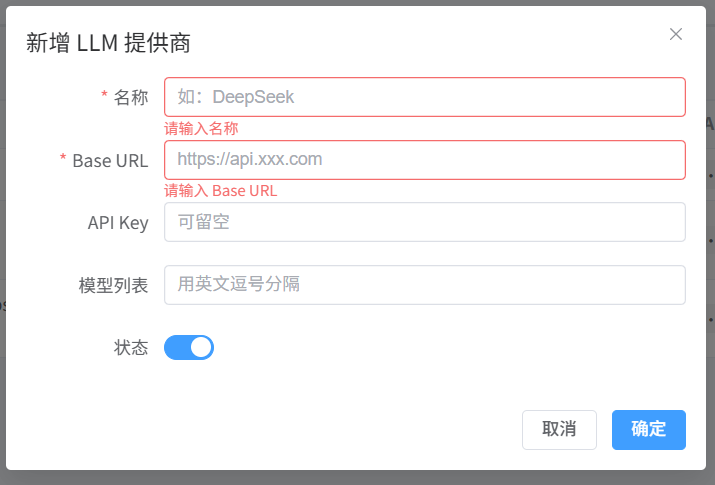

**TTS 配置界面**

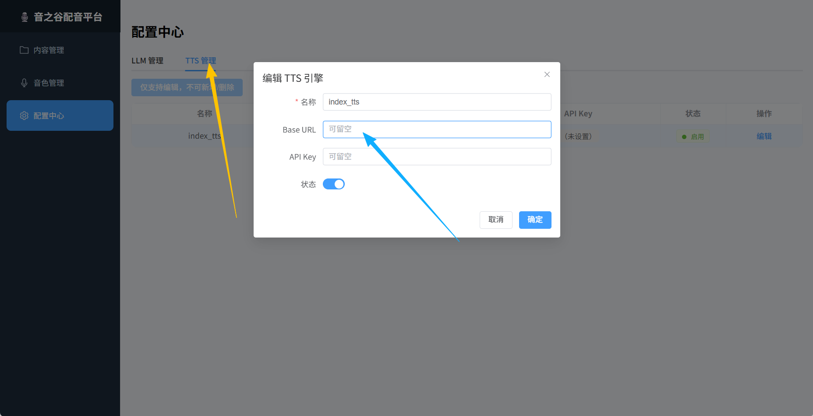

**音色管理界面**

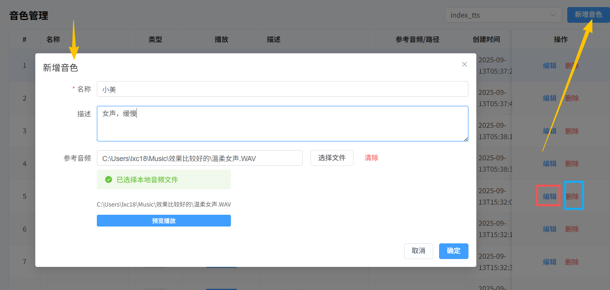

**项目创建界面**

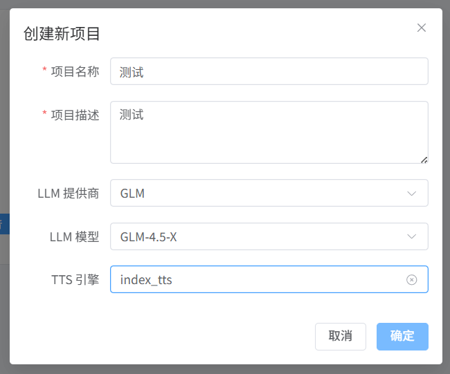

**章节创建界面**

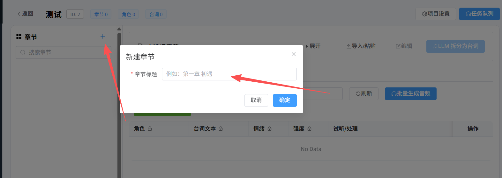

**章节内容导入**

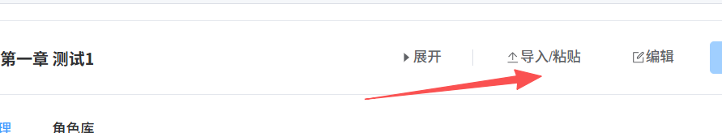

**台词自动拆分**

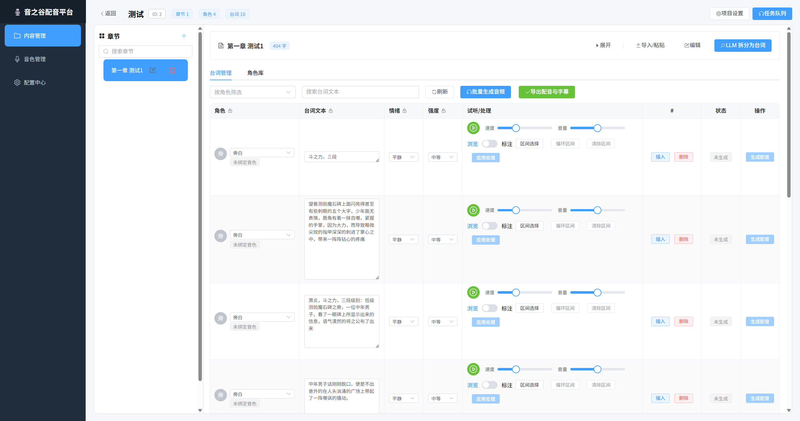

**角色绑定，多章节共享角色音色**

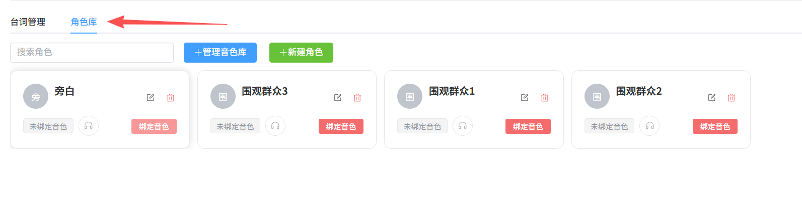

**台词编辑，高度自定义**

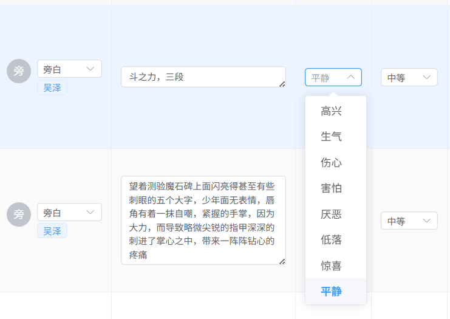

**配音生成**

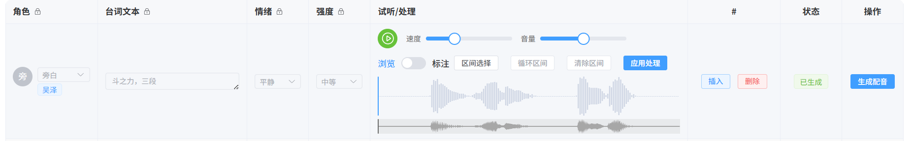

**生成后音频可编辑**

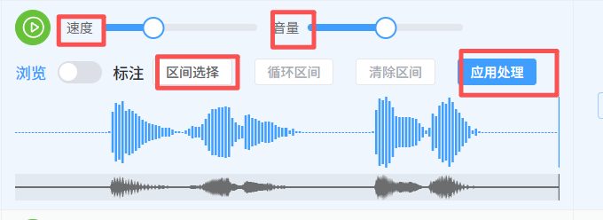

## 二次开发说明

本软件依据 **AGPL-3.0** 开源许可协议发布。基于本项目进行二次开发时，开发者须遵守以下规范：

### 署名要求

必须在衍生软件的用户界面及代码文档中清晰标注：

> "本软件基于开源项目《音谷》二次开发"

并附上原项目仓库链接。

### 商业使用限制

未获得书面商业授权前，任何基于本项目的衍生作品不得用于商业用途或提供商业服务。

## 联系方式

- **Bug / 功能建议**：[GitHub Issues](https://github.com/avy1357/sonicvale-aliyun/issues)
- **QQ 交流群**：1060711739（1群已满）、575715633（2群）（验证信息请填写 "音谷配音"）

## 赞助

如果您觉得我的项目对您有所帮助，欢迎赞助支持。

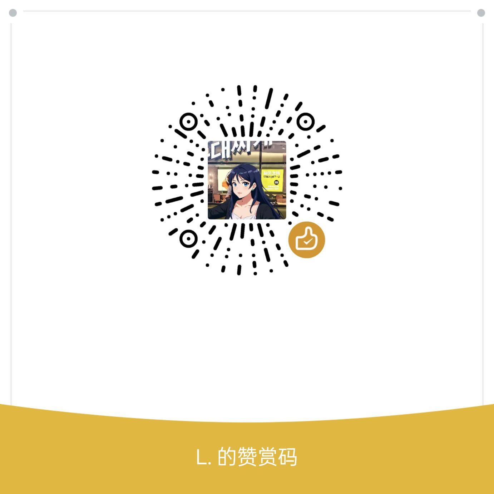

## 许可证

本项目采用 [GNU Affero General Public License v3.0 (AGPL-3.0)](./LICENSE) 开源协议。

## 免责声明

本项目仅供学习与研究使用。用户不得利用本项目从事任何违法违规行为，包括但不限于：

- 克隆或模仿未经授权的声音
- 侵犯他人声音权、肖像权、著作权、名誉权
- 其他可能违反法律法规的行为

开发者不对用户使用本项目所产生的任何后果负责，所有风险与责任由用户自行承担。使用本项目即表示您已阅读并同意本免责声明。

---

**Disclaimer**: This project is intended for research and educational purposes only. Users are strictly prohibited from using this project for any unlawful activities, including but not limited to cloning or imitating voices without authorization, infringing upon the rights of others, or any other activities in violation of applicable laws and regulations. The developer shall not be held liable for any consequences arising from the use of this project.
